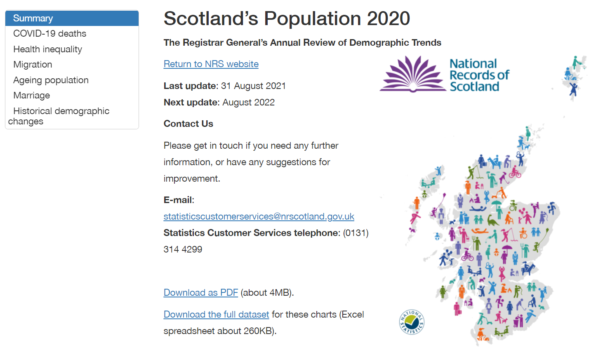

<div id="top"></div>
<!-- PROJECT LOGO -->
<br />
<div align="center">
  <a href="https://github.com/github_username/repo_name">
    
  </a>

<h1 align="center">RGAR 2020</h1>
<h2 align="center">Scotland's Population 2020 - The Registrar General's Annual Review</h2>
  
  <p align="center">
    "project description"
    <br />
    <a href="https://github.com/DataScienceScotland/RGAR_2020"><strong>Explore the docs »</strong></a>
    <br />
    <br />
    <a href="https://www.nrscotland.gov.uk/files//statistics/rgar/2020/scotlands-population-2020.html">View Output</a>
    ·
    <a href="https://github.com/DataScienceScotland/RGAR_2020/issues">Report Bug</a>
    ·
    <a href="https://github.com/DataScienceScotland/RGAR_2020/issues">Request Feature</a>
  </p>
</div>


<!-- TABLE OF CONTENTS -->
<details>
  <summary>Table of Contents</summary>
  <ol>
    <li>
      <a href="#about-the-project">About The Project</a>
      <ul>
        <li><a href="#built-with">Built With</a></li>
      </ul>
    </li>
    <li>
      <a href="#getting-started">Getting Started</a>
      <ul>
        <li><a href="#installation">Installation</a></li>
      </ul>
    </li>
    <li><a href="#contact">Contact</a></li>
    <li><a href="#license">License</a></li>
  </ol>
</details>


<!-- ABOUT THE PROJECT -->
## About The Project



"About the project"

<p align="right">(<a href="#top">back to top</a>)</p>


### Built With

* [R Studio](https://www.rstudio.com/)
* [R Markdown](https://rmarkdown.rstudio.com/)
* [CSS](https://www.w3schools.com/css/default.asp)

<p align="right">(<a href="#top">back to top</a>)</p>


<!-- GETTING STARTED -->
## Getting Started

This is an example of how you may give instructions on setting up your project locally.
To get a local copy up and running follow these simple example steps.

### Installation

1. Clone the repo or download the .zip 
   ```
   git clone https://github.com/DataScienceScotland/RGAR_2020.git
   ```
2. Open the project in R Studio

   ```
   RGAR.Rproj
   ```

3. Open the RMarkdown
   ```
   RGAR_2020.Rmd
   or
   RGAR_2020_pdf.Rmd (if knitting to PDF)
   ```
4. Click knit


<p align="right">(<a href="#top">back to top</a>)</p>


<!-- CONTRIBUTING -->
## Contributing

Contributions are what make the open source community such an amazing place to learn, inspire, and create. Any contributions you make are **greatly appreciated**.

If you have a suggestion that would make this better, please fork the repo and create a pull request. You can also simply open an issue with the tag "enhancement".
Don't forget to give the project a star! Thanks again!

1. Fork the Project
2. Create your Feature Branch (`git checkout -b feature/AmazingFeature`)
3. Commit your Changes (`git commit -m 'Add some AmazingFeature'`)
4. Push to the Branch (`git push origin feature/AmazingFeature`)
5. Open a Pull Request

<p align="right">(<a href="#top">back to top</a>)</p>


<!-- CONTACT -->
## Contact

Project Link: [https://github.com/DataScienceScotland/RGAR_2020](https://github.com/DataScienceScotland/RGAR_2020)
Contact details in the [final RGAR 2020 report](https://www.nrscotland.gov.uk/files//statistics/rgar/2020/scotlands-population-2020.html)

<p align="right">(<a href="#top">back to top</a>)</p>

<!-- LICENSE -->
## License

This repository is available under the [Open Government Licence v3.0.](https://www.nationalarchives.gov.uk/doc/open-government-licence/version/3/)

<p align="right">(<a href="#top">back to top</a>)</p>


